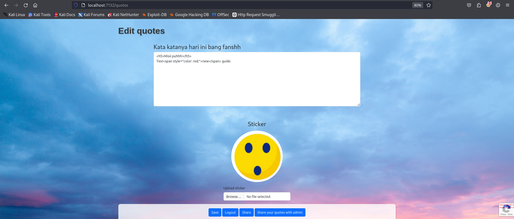
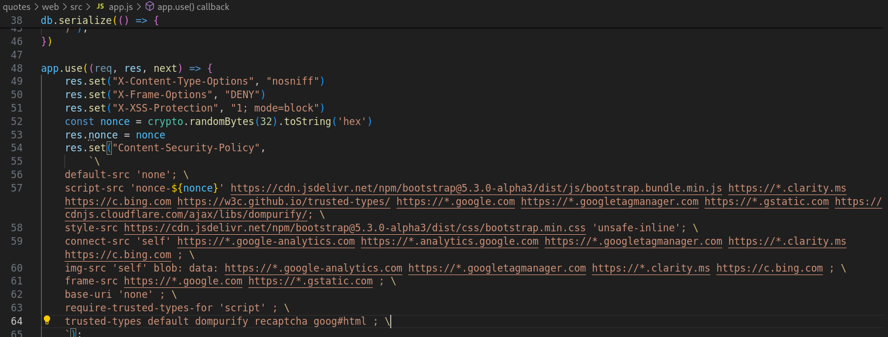
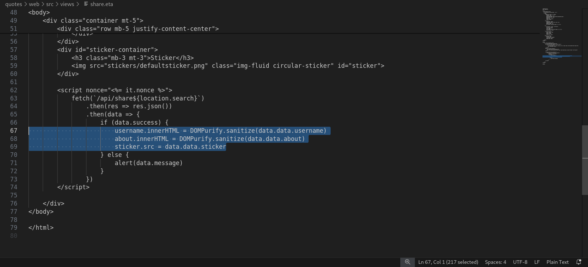
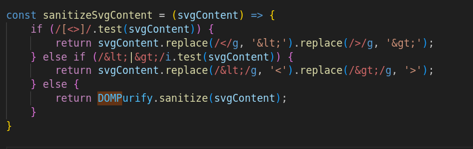
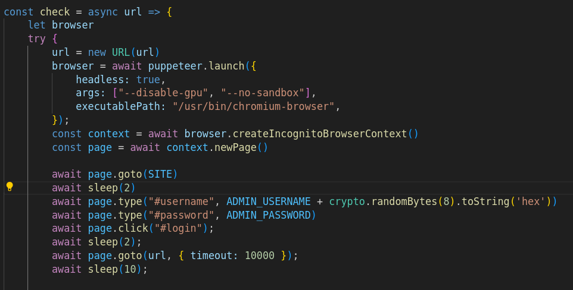
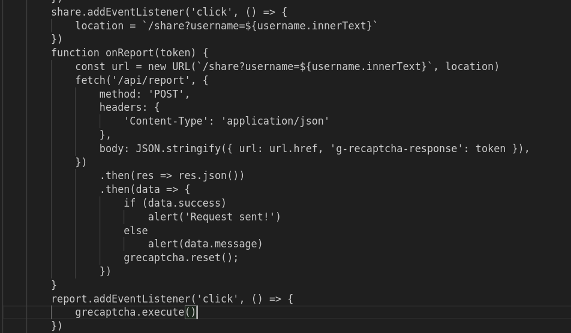
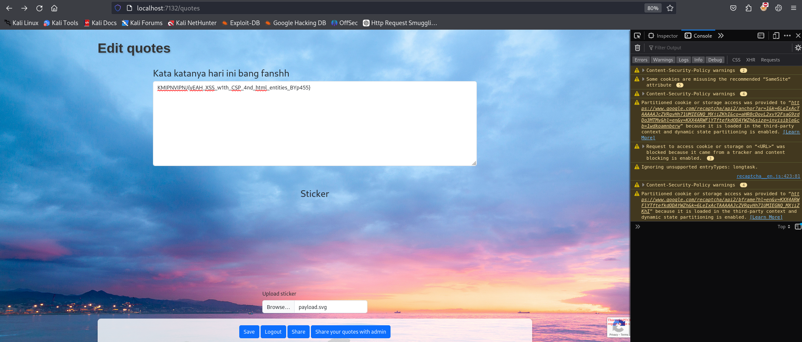

# Quotes
> NO NO NO...

## About the Challenge
Based on the challenge description, there are no suspicious clues. Let's see that.

## How to solve?
Terdapat 3 yang dapat dilakukan oleh user yaitu pada username, textarea untuk about dan upload file stickers. 


Pada app.py diketahui bahwa web ini menggunakan security csp tetapi ada script-src yang masih terdapat dari luar web salah satunya domain google.com. Pada halaman quotes `username`, `about` tidak dapat di lakukan xss injection karena ada `dompurify` yang melindungi dengan versi terbaru, sedangkan pada `upload file stickers` hanya ada `sanitasi html entites` pada tag < dan > dan bahkan ada clue decodenya ketika kita justru menggunakan &lt; dan &gt; diawal payload, 





Lalu tidak ada sanitasi dan akan langsung dieksekusi oleh bot menggunakna module Puppeteer untuk mengontrol Chrome atau Chromium untuk tugas-tugas otomatisasi web. 


oleh karena itu tinggal modif inner dari file yang kita unggah yaitu svg (payload.svg) kenapa pakai svg? karena yang saya pelajari bahwa dalam svg bisa menyisipkan javascript dan web ini menggunakan js.

Nah tapi pada file quotes ia menggunakan referensi url default adalah `/share?username=${username.innerText}` ini terjadi ketika kita klik share di halaman quotes, tetapi untuk melancarakan serangan harus klik share yaitu untuk mendapatkan url randomname dari svg yang kita upload. lalu ketika kita klik share quotes with admin maka grecaptcha akan di execute dan ketika dia diexecute maka memicu function onReport dijalan (berdasarkan callback)


oleh karenanya setelah mendapatkan url `randomname dari svg file yang kita upload` kita dapat menjalankan / menimpa func yang tadi mengandung url default dengan path / nama file svg baru kita. kita klik `share quotes with admin lalu ketika recaptcha berhasil maka tinggal kita reload page 1 sampai 2 kali maka flag muncul di textarea (berdasarkan payload svg kita)


kesimpulan:
```
1. ada 3 inputan user : username dan about (lock with dompurify) & file upload (lock with html entities)
2. func yang dijalankan pada saat click share admin akan di set url default yang salah. tinggal kita timpa dengan url baru (file svg) yang kita dapatkan saat click share.
3. func kita ambil formatnya dari file quotes.eta tinggal ubah url
4. enter di console lalu klik share admin refresh/reload halaman 1-2 kali setelah itu flag muncul
```

Penjelasan payload:
Harus menggunakan callback dari csp yang dapat dibypass yaitu dari domain google.com, saya pakai accounts.google.com. diarahkan ke api/quotes untuk dapatkan password berupa flag. lalu menggunakan const ADMIN_PASSWORD = data.data.password; menyimpan password admin, lalu kirimkan dengan register/login dgn username baru x/x lalu isi pada about di api/quotes di hal baru dengan password admin yang tadi disimpan.


```
KMIPNVIPNJ{yEAH_XSS_w1th_CSP_4nd_html_entities_BYp455}
```
